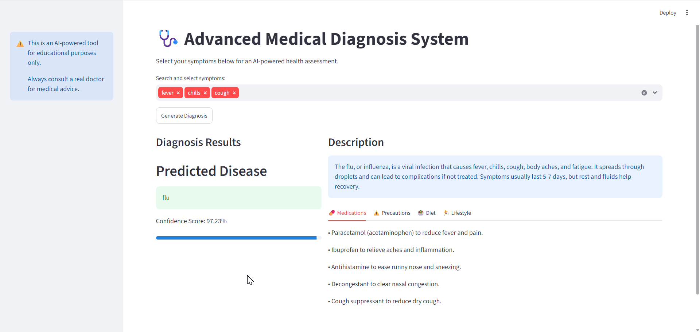
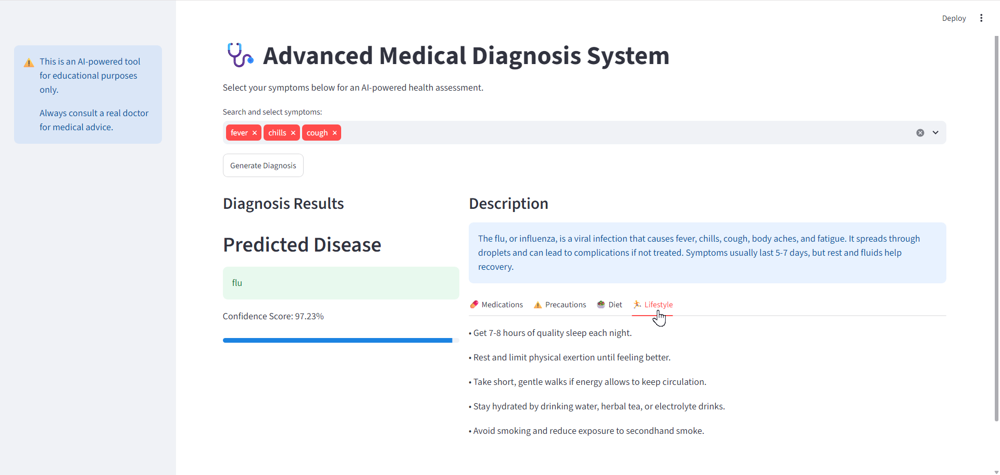

# AI-Based Medical Diagnosis System

A machine learning-based web application that predicts a potential disease from user-selected symptoms and provides AI-generated informational guidance.

> ⚠️ **Disclaimer:** This project is an educational prototype and is not a substitute for professional medical diagnosis, treatment, or advice. Users should consult a qualified healthcare professional for medical concerns.

## Overview

The AI-Based Medical Diagnosis System combines a trained machine learning model with symptom-based filtering and AI-generated guidance.

Users select their symptoms through a Streamlit interface. The system processes the selected symptoms, generates disease predictions using a trained neural network model, applies symptom matching to improve candidate filtering and ranking, and then uses the Groq API to generate structured informational guidance.

## Application Screenshots

### Main Interface & Prediction


### AI-Generated Guidance


## Key Features

* Symptom-based disease prediction
* Machine learning model trained for multi-class disease classification
* Symptom preprocessing and binary feature-vector generation
* Disease candidate filtering using symptom matching
* Weighted ranking using model confidence and symptom match
* AI-generated disease information and general guidance
* Structured sections for precautions, medications, diet, and lifestyle
* Streamlit-based interactive web interface
* Fallback guidance when AI-generated output is incomplete
* Medical disclaimer for educational use

## How It Works

```text
User selects symptoms
        ↓
Symptom preprocessing
        ↓
Binary symptom feature vector
        ↓
Trained ML model
        ↓
Top disease candidates
        ↓
Symptom matching & filtering
        ↓
Final predicted condition
        ↓
Groq API
        ↓
Structured informational guidance
        ↓
Streamlit UI
```

## Machine Learning Pipeline

1. User-selected symptoms are normalized and converted into a binary feature vector.
2. The trained neural network model generates prediction probabilities.
3. The system selects the top candidate diseases.
4. Each candidate is compared against the stored disease-symptom mapping.
5. Candidates are filtered using the number of matching symptoms.
6. A weighted score combines model confidence and symptom matching to rank the candidates.
7. The highest-ranked candidate is returned as the predicted condition.

## AI-Powered Guidance

The project uses the **Groq API** to generate structured informational content based on the predicted condition and selected symptoms.

The generated response contains:

* Disease information
* General precautions
* General medication information
* Diet suggestions
* Lifestyle suggestions

The application also includes fallback content to maintain a complete response if the AI-generated output does not satisfy the required structure.

## Technologies Used

**Languages & Frameworks**
* Python
* Streamlit

**Machine Learning & AI**
* TensorFlow / Keras
* NumPy
* Scikit-learn
* Groq API

**Data & Storage**
* Pandas
* Pickle

**Development Tools**
* Git
* GitHub
* Python-dotenv

## Project Structure

```text
AI-Based-Medical-Diagnosis-System/
│
├── app.py
├── ui.py
├── .gitignore
│
├── screenshots/
│   ├── main-ui.png
│   └── ai-guidance.png
│
└── model/
    ├── columns.pkl
    ├── disease_model.keras
    ├── disease_symptoms_map.pkl
    └── label_encoder.pkl
```

The original dataset is not included in this repository because of its size and dataset redistribution considerations.

## Setup & Installation

### 1. Clone the repository

```bash
git clone https://github.com/Nitika-Lakhani/AI-Based-Medical-Diagnosis-System.git
cd AI-Based-Medical-Diagnosis-System
```

### 2. Create and activate a virtual environment

```bash
python -m venv .venv
```

Windows:

```bash
.venv\Scripts\activate
```

### 3. Install dependencies

```bash
pip install streamlit tensorflow groq python-dotenv numpy pandas scikit-learn
```

### 4. Configure the Groq API key

Create a `.env` file in the project root:

```text
GROQ_API_KEY=your_groq_api_key
```

Never commit or upload the `.env` file.

### 5. Run the application

```bash
streamlit run ui.py
```

The application will open in your browser.

## Dataset

The original dataset was obtained from Kaggle and was subsequently processed for use in this project.

The processed dataset is intentionally excluded from this repository because of its large file size.

## Future Improvements

* Improve model evaluation using accuracy, precision, recall, and F1-score
* Add automated test cases
* Improve symptom matching and ranking
* Add model performance visualizations
* Improve error handling for API failures
* Deploy the application as a public web application

## Disclaimer

This application is developed for educational and demonstration purposes only. Its predictions and AI-generated information should not be considered medical advice or used for self-diagnosis or treatment decisions. Always consult a qualified healthcare professional for medical concerns.
